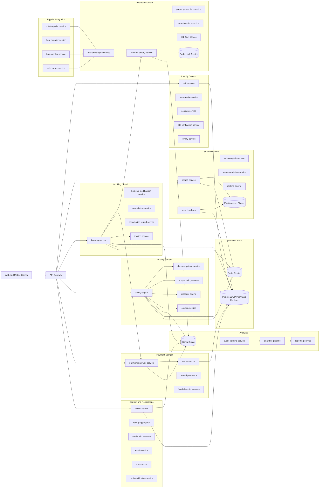

# 1) Service Architecture Diagram

## Domain services

- Identity: auth-service, user-profile-service, session-service, otp-verification-service, loyalty-service
- Search: search-service, search-indexer, autocomplete-service, recommendation-service, ranking-engine
- Inventory: property-inventory-service, room-inventory-service, seat-inventory-service, cab-fleet-service, availability-sync-service
- Booking: booking-service, booking-modification-service, cancellation-service, refund-service, invoice-service
- Pricing: pricing-engine, dynamic-pricing-service, surge-pricing-service, discount-engine, coupon-service
- Payment: payment-gateway-service, wallet-service, refund-processor, fraud-detection-service
- Supplier: hotel-supplier-service, flight-supplier-service, bus-supplier-service, cab-partner-service
- Content: review-service, rating-aggregator, moderation-service
- Notification: email-service, sms-service, push-notification-service
- Analytics: event-tracking-service, analytics-pipeline, reporting-service
- Infrastructure: api-gateway, service-discovery, monitoring-stack

## Logical architecture

## Critical booking lifecycle

search -> hold inventory -> payment -> confirm booking
