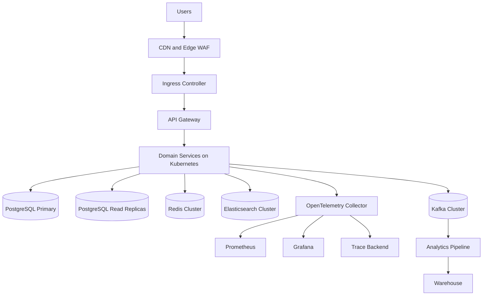

# 6) Deployment Architecture

## Platform stack

- Containers: Docker
- Orchestration: Kubernetes
- Datastores: PostgreSQL primary + replicas, Redis Cluster, Elasticsearch Cluster, Kafka Cluster
- Ingress: API gateway + NGINX ingress

## Deployment topology

## K8s namespaces

- ota-core
- ota-search
- ota-inventory
- ota-booking
- ota-pricing
- ota-payments
- ota-analytics
- ota-observability

## High availability targets

- Multi-AZ deployment for API gateway, booking, payment, inventory lock workers
- PostgreSQL synchronous replication for primary failover
- Redis cluster with quorum and persistence
- Kafka with replication factor 3 and min in-sync replicas 2
- Elasticsearch hot-warm nodes with shard rebalancing

## CI/CD flow

commit -> unit tests -> integration tests -> contract tests -> security scan -> image build -> push -> staging deploy -> smoke tests -> production deploy

## Release strategy

- Canary per service with 5%, 25%, 50%, 100% traffic ramps
- Automatic rollback on SLO breach
- Feature flags for risky paths: payment routing, booking modify, supplier adapters
